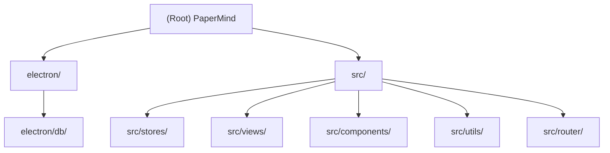

# PaperMind

**变更记录**
- 2026-07-19T14:49:32: 前端 UI 美化（青绿主色、侧栏/知识库卡片/对话面板视觉升级）
- 2026-07-18T00:00:00: 检索管线升级（语义分块 + 查询改写 + 评分多选）
- 2026-06-07T21:33:55: 初始化 AI 上下文文档

---

## 项目愿景

本地运行的学术论文阅读助手桌面应用。所有数据存储在本地（SQLite + 磁盘 PDF），无后端服务，支持多 LLM provider（OpenAI / Anthropic / Ollama）进行论文问答。

## 架构概览

```
Renderer Process (Vue 3)          Main Process (Node/Electron)
┌──────────────────────────┐      ┌─────────────────────────────┐
│  Vue Router (hash mode)  │      │  electron/main.ts           │
│  Pinia Stores            │      │  electron/ipc.ts            │
│  Element Plus UI         │◄────►│  electron/db/index.ts       │
│  pdfjs-dist (PDF 渲染)   │ IPC  │  electron/db/schema.ts      │
│  直接 fetch → LLM API    │      │  better-sqlite3             │
└──────────────────────────┘      └─────────────────────────────┘
```

contextBridge 将 `window.db` 注入渲染层，所有数据库操作通过 IPC 通道调用主进程。LLM 请求由渲染层直接发出（fetch），不经过主进程。

## 模块结构



## 模块索引

| 模块 | 路径 | 职责 |
|------|------|------|
| 主进程 | `electron/` | Electron 入口、IPC 注册、SQLite 数据层 |
| 状态管理 | `src/stores/` | Pinia stores（论文/知识库、对话/LLM配置） |
| 页面视图 | `src/views/` | 知识库、阅读器、对话、设置四个路由页面 |
| 公共组件 | `src/components/` | PdfViewer、ChatPanel、ParamPanel |
| 工具函数 | `src/utils/` | PDF 元数据解析、base64 转 Blob URL |
| 路由 | `src/router/` | Vue Router hash 模式路由配置 |

## 运行与开发

```bash
# 安装依赖（会自动 rebuild better-sqlite3）
npm install

# 开发模式（Vite dev server + Electron）
npm run dev

# 类型检查
npm run typecheck

# 生产构建 + 打包
npm run build

# 手动重建 native 模块
npm run rebuild
```

构建产物：`dist/`（渲染层）、`dist-electron/`（主进程）、`release/`（安装包）。

## 测试策略

使用 **Vitest**（与 Vite 同生态）。

```bash
npm test          # 单次运行
npm run test:watch  # watch 模式
npm run test:ui   # 浏览器 UI
```

| 文件 | 覆盖内容 |
|------|---------|
| `src/tests/paper.store.test.ts` | usePaperStore：init、CRUD、idempotent、fileData 剥离 |
| `src/tests/chat.store.test.ts` | useChatStore：init、对话 CRUD、config、sendMessage（含 RAG 管线调用次数校验） |
| `src/tests/pdfUtils.test.ts` | base64ToUrl：URL 格式、Blob type；detectSectionBoundaries：英/中标题识别、降级；mergeSmallSections：边界合并逻辑 |
| `src/tests/pageIndex.test.ts` | scoreAndSelect：Top-2 选取、阈值、JSON 降级、单节点短路；buildPageIndex：预边界页面不丢失 |

**Mock 策略**：`src/tests/setup.ts` 在全局 `window.db` 上注入 `vi.fn()` mock，stores 完全与 Electron IPC 解耦，无需启动 Electron 即可测试业务逻辑。

**待补充**：`parsePdfMeta` fixture 测试（需真实 PDF 文件）、Vue 组件渲染测试（PdfViewer、ChatPanel）。

## 编码规范

- TypeScript strict 模式（见 `tsconfig.json`）
- Vue 3 Composition API + `<script setup>`
- Pinia store 使用 setup 函数风格
- 主进程 API 均为同步 better-sqlite3 调用，IPC handler 通过 `ipcMain.handle` 注册
- JSON 字段（authors、tags、paper_ids、sources）在 SQLite 中以 TEXT 存储，读取时反序列化
- 渲染层通过 `window.db.*` 调用，类型声明在 `src/types/db.d.ts`
- CSS 变量统一在 `src/styles/global.css` 中定义，组件内使用 `scoped` 样式

## AI 使用指南

- 修改数据模型时，需同步更新：`electron/db/schema.ts`、`electron/db/index.ts`（序列化/反序列化）、`src/stores/paper.ts` 或 `src/stores/chat.ts` 中的接口定义、`src/types/db.d.ts`
- 新增 IPC 通道：在 `electron/ipc.ts` 注册 handler，在 `electron/preload.ts` 暴露方法，在 `src/types/db.d.ts` 补充类型
- LLM 调用逻辑全部在 `src/stores/chat.ts` 的 `sendMessage` 方法中；RAG 管线为 3-call 流程：查询改写（`rewriteQuery`，有历史时）→ 评分多选（`scoreAndSelect`）→ 生成回答
- 检索/索引逻辑在 `src/utils/pageIndex.ts`：`buildPageIndex` 构建语义分块索引，`scoreAndSelect` 替换原有 `retrieve`（已删除）；修改检索策略只需改这一个文件
- `detectSectionBoundaries` 和 `mergeSmallSections` 均已导出，可在测试中直接使用
- PDF worker 使用本地文件 `/pdf.worker.min.mjs`（`public/` 目录），由 `vite.config.ts` 启动时从 `node_modules/pdfjs-dist/build/` 复制，离线可用
